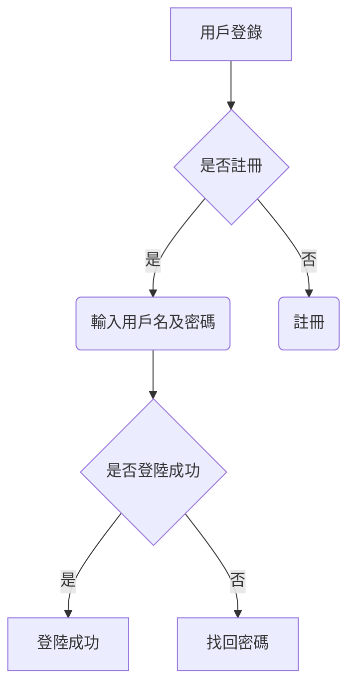

# 一級標題  
## 二級標題  
### 三級標題  
---
**粗體**
*斜體*
***粗體兼斜體***
~~刪除~~
---
[google](http://www.google.com/)


---
> 尋找海藍的博客是世界上最好的博客  --馬雲
>> 馬爺說得對 --尋找海藍
>>> PHP是世界上最好的語言 --Linus 
---
- 無序列表項 一
- 無序列表項 二
- 無序列表項 三
---
1. 有序列表項 一
2. 有序列表項 二
3. 有序列表項 三
---
1. one
    1. one-1
    2. two-2
2. two 
    * two-1
    * two-2
---
* one
  
    var a = 10;
---
| 公司     | 國別 | 行業     |
| -------- | ---- | -------- |
| 阿里巴巴 | 中國 | 電商     |
| 谷歌     | 美國 | 搜索     |
| 戴姆勒   | 德國 | 汽車製造 |
| 東京熱   | 日本 | 電影藝術 |

---
用`>>> print 'hello, world'`就可以打出 hello, world.

---
```JavaScript
let f = () => {
 console.log('hello world');   
}
```
---


    let f = () => {
    console.log('hello world');   
    }


---

```math
E = mc^2
```

---

- [x] 分析需求
- [ ] 研發
- [ ] 測試

---


---

$$ x = {-b \pm \sqrt{b^2-4ac} \over 2a}$$

---
Markdown[^1]

[^1]: Markdown是一種純文本標記語言      

---
<xxx@outlook.com>

---
